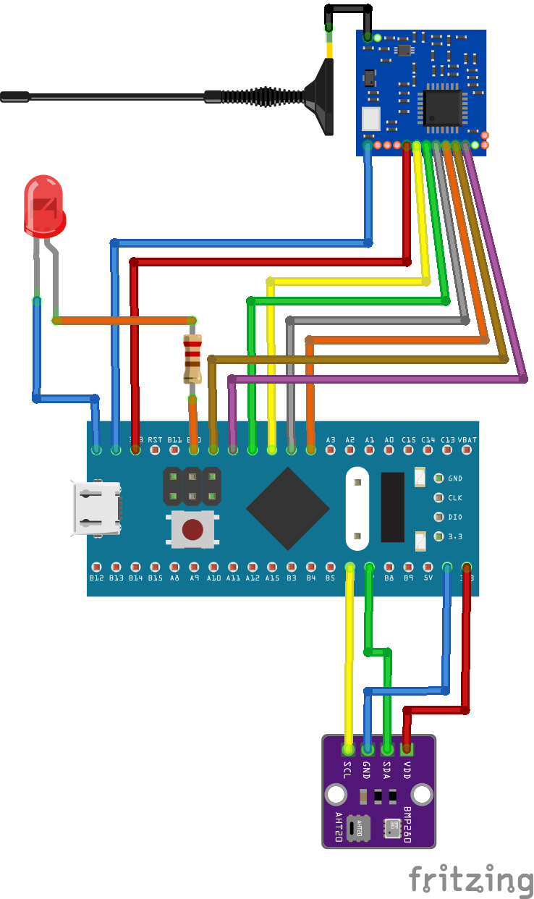

# STM32 LoRa Receiver 
# (STM32F411CEU6 + SX1278 + SHT20)

## Description

This project implements the transmitter in a two-node LoRa communication system.
The STM32F411CEU6 reads temperature and humidity data from the SHT20 sensor and sends it over LoRa using the SX1278 module.

---

## Connections

## SX1278 (LoRa) → STM32

| SX1278 | STM32 | Description     |
| ------ | ----- | --------------- |
| VCC    | 3.3V  | Power           |
| GND    | GND   | Ground          |
| NSS    | PA4   | SPI Chip Select |
| SCK    | PA5   | SPI Clock       |
| MISO   | PA6   | SPI MISO        |
| MOSI   | PA7   | SPI MOSI        |
| RESET  | PB0   | Reset           |
| DIO0   | PB1   | Interrupt       |  

> SPI pins may vary depending on your microcontroller.

## SHT20 → STM32
| SHT20 | STM32 | Description |
| ----- | ----- | ----------- |
| VCC   | 3.3V  | Power       |
| GND   | GND   | Ground      |
| SDA   | PB7   | I2C Data    |
| SCL   | PB6   | I2C Clock   |

---
## Circuit Diagram

---
## Main loop

1. Initialize peripherals
2. Read temperature and humidity from the SHT20
3. Pack the data into a LoRa packet
4. Send the packet via SX1278
5. Enter low power mode

---
#  Author

### Vadym Minder

---

